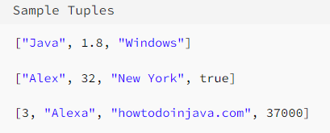
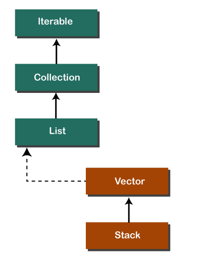

= Good to know

== Tuple in general:

A tuple can be seen as an ordered collection of objects of different types. These objects do not necessarily relate to each other in any way, but collectively they will have some meaning.

Java doesn't have any such inbuilt data structure to support tuples. Whenever required, we can create a class that can act like a tuple.

Also, in Java, part of the tuple functionality can be written using List or Array but those will not allow us to hold different types of data types by design. So we can say that heterogeneous tuples using a standard data structure is not possible in Java.

== Comparison of Tuples vs Lists/Arrays:

A tuple is often compared with List as it looks very much like a list. But they differ in some aspects.

- A tuple is an object that can contain heterogeneous data. Lists are designed to store elements of a single type.

- Out of all data structures, a tuple is considered to be the fastest, and they consume the least amount of memory.

- While array and list are mutable which means you can change their data value and modify their structures, a tuple is immutable.

- Like an array, a tuple is also fixed in size. That is why tuples aim to replace array completely as they are more efficient in all parameters.

- If you have a dataset which will be assigned only once in a lifetime and its value should not change again, you need a tuple.

'''

== Multiple type of ArrayList:

List<Object> multipleTypeObjects = new ArrayList <Object>();

== Java Stack

The stack is a linear data structure that is used to store the collection of objects. It is based on Last-In-First-Out (LIFO). Java collection framework provides many interfaces and classes to store the collection of objects. One of them is the Stack class that provides different operations such as push, pop, search, etc.

In this section, we will discuss the Java Stack class, its methods, and implement the stack data structure in a Java program. But before moving to the Java Stack class have a quick view of how the stack works.

The stack data structure has the two most important operations that are push and pop. The push operation inserts an element into the stack and pop operation removes an element from the top of the stack. Let's see how they work on stack.

Let's push 20, 13, 89, 90, 11, 45, 18, respectively into the stack.

Let's remove (pop) 18, 45, and 11 from the stack.

#Empty Stack:# If the stack has no element is known as an empty stack. When the stack is empty the value of the top variable is -1.

The following table shows the different values of the top.

Java Stack

Java Stack Class

In Java, Stack is a class that falls under the Collection framework that extends the Vector class. It also implements interfaces List, Collection, Iterable, Cloneable, Serializable. It represents the LIFO stack of objects. Before using the Stack class, we must import the java.util package. The stack class arranged in the Collections framework hierarchy, as shown below.

